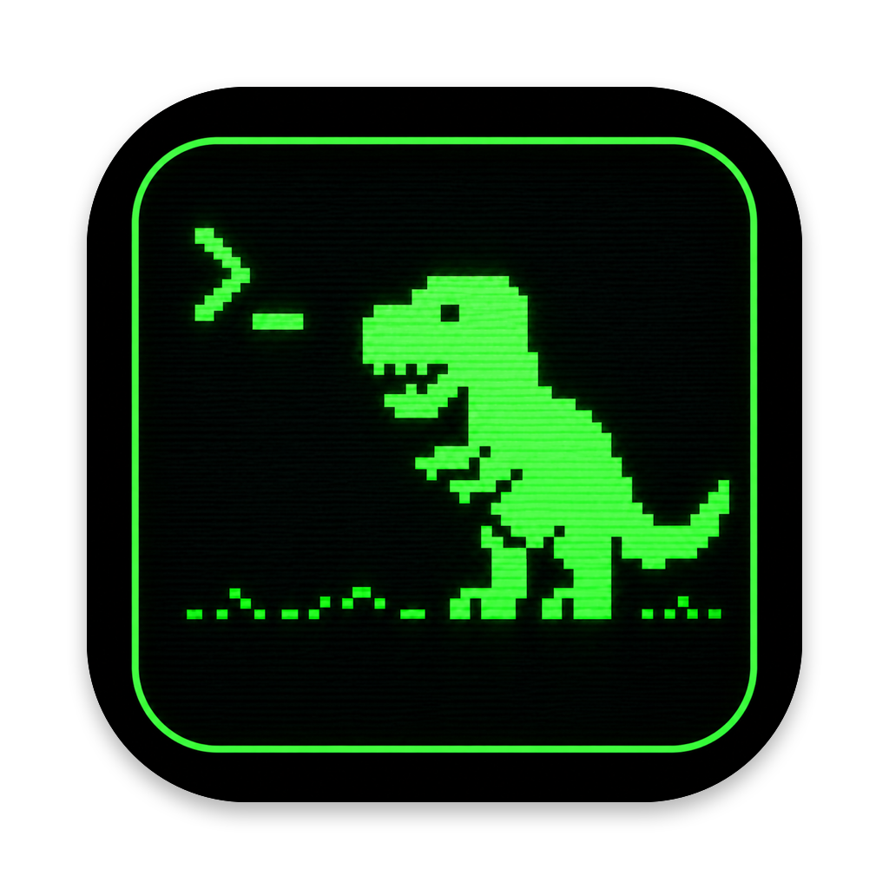

<!-- markdownlint-disable MD041 -->
> [!NOTE]
> **Detached fork.** T-Rex is a personal, detached fork of [manaflow-ai/cmux](https://github.com/manaflow-ai/cmux) maintained by [@crmolinaz](https://github.com/crmolinaz), carrying fork-specific changes. See [Fork changes](#fork-changes) below or [CHANGELOG.md](CHANGELOG.md).

<p align="center">
  
</p>

<h1 align="center">T-Rex</h1>
<p align="center">A Ghostty-based macOS terminal with vertical tabs and notifications for AI coding agents</p>

## Fork changes

Changes specific to this detached fork, newest first (full history in [CHANGELOG.md](CHANGELOG.md)):

- **T-Rex branding** — fork-specific name, icon, and a `trex` CLI alias, isolated from stock cmux.
- **Per-tab shell history + configurable session restore** ([#1](https://github.com/crmolinaz/trex/pull/1)) — each terminal tab keeps its own ↑ / Ctrl-R shell history, restored when the tab reopens, plus a per-tab command-history view (Command Palette → "Show Command History"); session restore on launch is configurable as always / ask / never (default ask).

## Install

This fork has no prebuilt release. Build and install it locally with the included script:

```bash
git clone https://github.com/crmolinaz/trex.git
cd trex
./scripts/setup.sh             # one-time: submodules + GhosttyKit
./scripts/install-personal.sh  # build Release, install /Applications/T-Rex.app
```

`install-personal.sh` builds the latest `main`, installs **T-Rex** into `/Applications` with an isolated bundle id and socket so it runs alongside stock cmux, links a `trex` command on your `PATH`, and stamps the build with a timestamp version (shown in **T-Rex → About**). Re-run it any time to update.

Flags:

| Flag | Effect |
|------|--------|
| `--no-sync` | Build the currently checked-out code instead of syncing to `main` |
| `--launch` | Open the app after installing |
| `--name <name>` | Install under a different app name |

## License

T-Rex is a modified version of [cmux](https://github.com/manaflow-ai/cmux) (© Manaflow, Inc.) and is distributed under the [GNU General Public License v3.0 or later](LICENSE). The complete corresponding source for this fork, including all modifications, is available at <https://github.com/crmolinaz/trex>.

This program is free software: you can redistribute it and/or modify it under the terms of the GPL as published by the Free Software Foundation, either version 3 of the License, or (at your option) any later version. It is distributed in the hope that it will be useful, but WITHOUT ANY WARRANTY; without even the implied warranty of MERCHANTABILITY or FITNESS FOR A PARTICULAR PURPOSE. See [LICENSE](LICENSE) for details.
